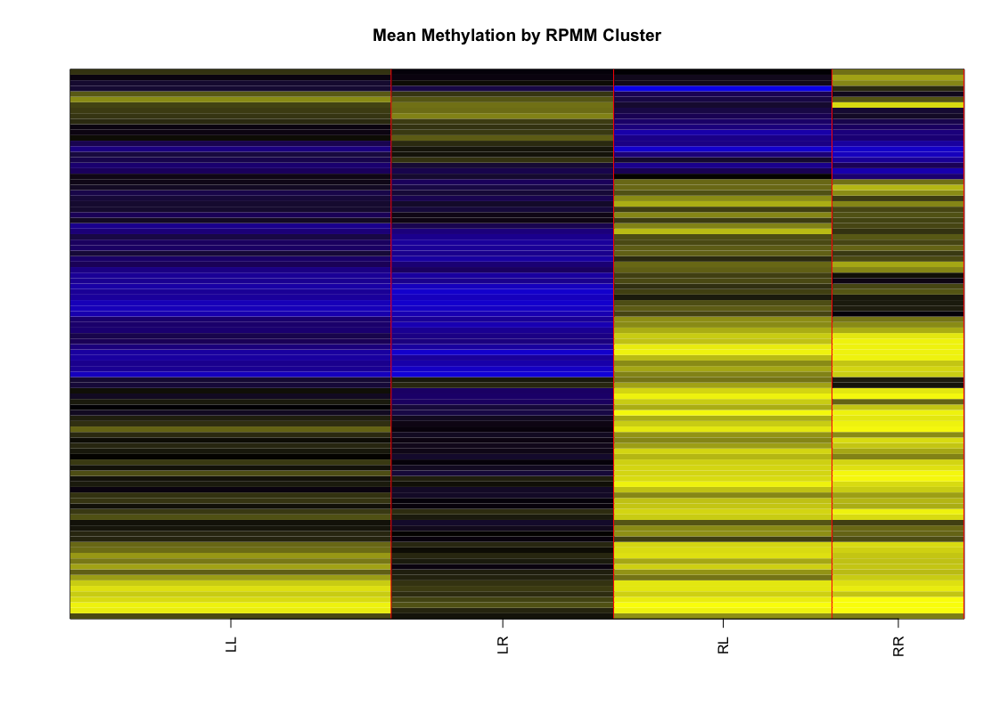

RPMM Tutorial with Heat Map Data Visualization
================
David Chen, Christensen Lab
6/11/2018

Motivation
----------

RPMM: Recursively Partitioned Mixture Model is an iterative, unsupervised approach to identify clusters (subgroups) within high-dimensional data. It has been extensively used in analyzing **DNA methylation** of cytosine-phosphate-guanine (CpG) dinucleotides of the mammalian genome.

As the name suggests, RPMM models data using multiple Beta- or Gaussian distributions. The iterative clustering is based on Bayesian Information Criterion (BIC) score and posterior probability (Houseman et al. 2008). Subsequent works of the authors have demonstrated efficient implementation of RPMM and robustness of the approach compared to conventional clustering methods such as K-means. Works of other groups, including the large-scale cohort study The Cancer Genome Atlas (TCGA) project, have applied RPMM for biological discovery.

Preparation and Import Packages
-------------------------------

We will use a built-in data set in the RPMM R package. No external data set is needed for this tutorial.

``` r
library(RPMM)
```

    ## Loading required package: cluster

    ## Warning: package 'cluster' was built under R version 3.4.4

``` r
library(seriation)
library(pheatmap)

set.seed(1234) #reproducibility
data("IlluminaMethylation") #217 tissues x 100 CpGs; see RPMM documentation
Y_inv <- IllumBeta #copy
rownames(Y_inv) <- paste("Sample", rownames(Y_inv), sep="_")
```

For this demo, we will consider a simple scenario by spliting the data set only twice. To do so, we will set the `maxlevel` argument to the desired number. If not set, this argument defaults to ∞, i.e. no restriction on the number of possible clusters.

``` r
nSplit <- 2 #if not set, defaults to Inf
myRPMM <- blcTree(Y_inv, maxlevel=nSplit, verbose=1)
```

    ## [1] "root"
    ## [1] 19515.74
    ## [1] "rL"
    ## [1] 11545.45
    ## [1] "rLL"
    ## [1] 10092.69
    ## [1] "rLR"
    ## [1] 4756.384
    ## [1] "rR"
    ## [1] 14318.29
    ## [1] "rRL"
    ## [1] 9333.953
    ## [1] "rRR"
    ## [1] 5943.841

``` r
myRPMM
```

    ## Recursively partitioned beta mixture model:   7 nodes, 4 terminal nodes.

Let's preview the clustering dendrogram for RPMM:

``` r
plotTree.blcTree(myRPMM)
title("RPMM Clustering Dendrogram")
```


Extract RPMM cluster assignment
-------------------------------

The RPMM function `blcTreeLeafClasses` extracts cluster assignments (hard cluster labels). The order of the samples are the same as the `row.names` of the matrix (which is `Y_inv` here) passed into the `blcTree` function. You may refer to the example from the RPMM package for the official implementation.

``` r
myHardLabels <- blcTreeLeafClasses(myRPMM)
names(myHardLabels) <- rownames(Y_inv) 

myHardLabels <- as.data.frame(myHardLabels)
colnames(myHardLabels) <- "RPMM"
table(myHardLabels$RPMM)
```

    ## 
    ## rLL rLR rRL rRR 
    ##  78  54  53  32

In the following plot, we show *mean value of samples within a given cluster*:

``` r
plotImage.blcTree(myRPMM)
title("Mean Methylation by RPMM Cluster")
```



Instead of the mean value by cluster, we can also display sample-by-sample methylation values according to RPMM-determined sample (row) order:

``` r
## The following function from original author has been modified
## Original R function can be found in Christensen Lab GitHub page (this repo)
plotMethByClass <- function(BETA, CLASS, sep="red", method="ward.D",
                           col=colorRampPalette(c("yellow","black","blue"))(128),
                           main="Individual Methylation Profile after RPMM Clustering"){
  #'@author Original RPMM authors
  #'@param BETA nSubj * nCpG matrix
  #'@param CLASS Vector of RPMM output
  #'@param method Clustering method
  #'@param col Colors for heat map. Default: yello=0, blue=1
  #'@param main Title of the plot
  #'@return None (graphic device only)
  #'@example plotMethByClass(autoB, RCCclass1)
  
  ## Initialize plot canvas:
  nColor <- length(col)
  nSubj <- dim(BETA)[1]
  nCpG <- dim(BETA)[2]
  index <- split(1:nSubj, CLASS)
  nClass <- length(index)
  plot(c(0,nCpG), c(0,nSubj), type="n", xlab="", ylab="", xaxt="n", yaxt="n", bty="n")
  ordCpG <- hclust(dist(t(BETA)), method=method)$ord
  BETA <- BETA[ , ordCpG]
  
  ## Nested iterative plot update:
  k <- 0
  for(i in 1:nClass){
    ii <- index[[i]]
    nii <- length(ii)
    ord <- hclust(dist(BETA[ii, ]), method=method)$ord
    for(j in 1:nii){
      colori <- ceiling(BETA[ii[ord[j]],] * nColor)
      rect(1:nCpG-1,k,1:nCpG,k+1,col=col[colori],density=-1,border=NA)
      k <- k+1
    }
    if( i < nClass ){ 
      lines(c(0,nCpG), c(k,k), col=sep, lwd=2)
    }
  }
  
  ## Canvas labeling:
  nn <- cumsum(c(0,unlist(lapply(index,length))))
  axp <- 0.5 * (nn[-1]+nn[-nClass-1])
  axis(2, axp, names(index), las=2, lwd=3, cex=3)
  title(main)
}

## Plot
plotMethByClass(
  Y_inv,
  myHardLabels$RPMM[match(rownames(myHardLabels), rownames(Y_inv))]
)
```


Consistent with what we have seen in the clustering dendrogram, samples within each of the four RPMM clusters were grouped nicely together.

(Advanced) Extract the posterior probabilities for the cluster assigned
-----------------------------------------------------------------------

RPMM cluster assignment assumes a *softmax* framework: Each sample will be assigned probabilities ("soft labels") for all possible classes. A cluster assignment ("hard label") is determined based on the maximum probability.

Now extract posterior cluster probabilities as a matrix, and then manually apply *softmax*:

``` r
posteriorProbs <- blcTreeLeafMatrix(myRPMM)
rownames(posteriorProbs) <- rownames(Y_inv)

unsup_soft <- data.frame(
  RPMM.maxPosterior = apply(posteriorProbs, 1, FUN=max),
  RPMM.hard = colnames(posteriorProbs)[apply(posteriorProbs, 1, FUN=which.max)]
)
```

We can (and should) check to see if the hard probabilities we manually determined are the same as those returned by `blcTreeLeafClasses`:

``` r
all( as.character(unsup_soft$RPMM.hard) == as.character(myHardLabels$RPMM)  )
```

    ## [1] TRUE

Part II (Optional): Enhanced Heat Map Visualization
---------------------------------------------------

While many R packages could be used to draw heat maps, here we choose `pheatmap` as it is rather convenient to use. Other packages such as `heatmap.3` could also be used, though their syntax may vary.

We will use the `seriation` package to retrieve sample order. The detail of this procedure can be found in *pages 15-17 of the tutorial* authored by Hinoue et al. (2012, see References below).

``` r
sampOrder <- c()
for( r in names(table(myHardLabels$RPMM)) ) {
  samps <- rownames(myHardLabels)[myHardLabels$RPMM == r]
  clu <- t(Y_inv[samps, ]) #Hinoue et al
  s_i <- seriate(clu, margin=2) #Hinoue et al
  so_i <- get_order(s_i) #Hinoue et al
  sampOrder <- c(sampOrder, samps[so_i]) #Hinoue et al
}
```

By default, `pheatmap` will implement hierarchical clustering with Euclidean distance and complete linkage (`hclust` in base; see documentation). Here, since we used RPMM to identify clusters and extracted sample orders from the RPMM output, we will:

-   Turn off `pheatmap`'s clustering algorithm
-   Re-order the data matrix based on sample order extracted from RPMMM
-   Draw heat map based on RPMM sample order that we have extracted

Details regarding constructing the rows and tracking bars can be found in the `pheatmap` documentation and working examples, and won't be re-introduced in this tutorial.

``` r
sample_annotation <- as.data.frame(myHardLabels) #or merge myHardLabels into existing annotation
mat <- t(Y_inv[sampOrder, ]) #invert to row=feature, column=sample format
pheatmap(
  mat = mat, #reorder based on sample order retrieved
  cluster_cols = FALSE, #turn off hierarchical clustering
  annotation_col = sample_annotation,
  color = colorRampPalette(c("yellow","black","blue"))(512),
  border_color = NA,
  fontsize_row = 5,
  fontsize_col = 4,
  fontsize = 10
)
```


Other Notes
-----------

-   You may proceed to testing cluster membership with available variables, such as by disease status (i.e. 1=cases vs. 0=controls) or the presence of a specific mutation among tumor samples (i.e. 1=mutated, 0=wild-type).
-   In addition to DNA methylation, RPMM algorithm could be applied to a variety of molecular data types. The Gaussian RPMM implemented in the function `glcTree` may be useful.

References
----------

-   Hinoue T, Weisenberger DJ, Laird PW. TCGA COAD/READ DNA Methylation (2012) `https://pdfs.semanticscholar.org/f47a/28e8e2f7598b6e94de7ef3279957b6e55ec2.pdf`
-   Houseman EA, Christensen BC, Yeh RF, Marsit CJ, Karagas MR, Wrensch M, Nelson HH, Wiemels J, Zheng S, Wiencke JK, Kelsey KT. Model-based clustering of DNA methylation array data: a recursive-partitioning algorithm for high-dimensional data arising as a mixture of beta distributions. BMC Bioinformatics, 9(1): 365 (2008) `https://www.ncbi.nlm.nih.gov/pubmed/18782434/`
-   Houseman. RPMM: Recursively Partitioned Mixture Model. CRAN R package version 1.25 `https://cran.r-project.org/web/packages/RPMM/`
-   The Cancer Genome Atlas (TCGA) Project. National Institute of Health `https://cancergenome.nih.gov`
